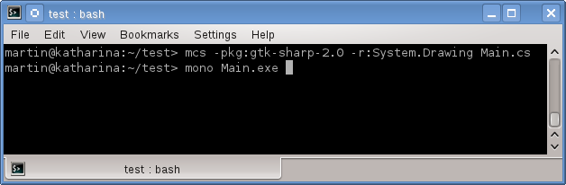
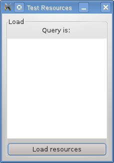
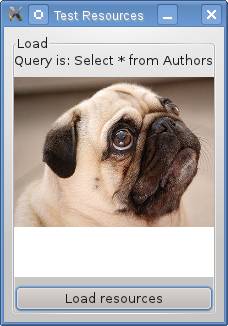

# Entendiendo Satellite Assemblies usando MonoDevelop - (parte 2)

    En la <a href="http://xomalli.blogspot.com/2011/12/entendiendo-satellite-assemblies-usando.html">primera parte</a> de este tutorial, se mostra como crear Satellite Assemblies, ahora en este segunda parte se mostrara un listado donde se muestra el codigo que nos mostrara los pasos de como consumir los ensamblados satelite o ensamblados de recursos desde una aplicacion GTK#.
    

    

    Toda esta funcionalidad se encuentra en el metodo <tt>LoadResources()</tt> , este metodo comienza primeramente con la carga en tiempo de ejecucion del ensamblado que contiene los recursos utilizando las lineas siguientes:
    

    <pre>
    string assem = "demo.resources.dll";
    Assembly assembly = Assembly.LoadFrom(assem);
    </pre>
    

    A continuacion creamos una instancia de la clase <a href="http://msdn.microsoft.com/en-us/library/system.resources.resourcemanager.aspx">ResourceManager</a> en la cual se encuentran los metodos para obtener los recursos del ensamblado, en este ejemplo obtenemos un recurso de tipo cadena y otro de tipo imagen, con el codigo de las li­neas siguientes
    

    <pre>
    label1.Text += rm.GetString("query1"); 
    System.Drawing.Bitmap bitmap = (System.Drawing.Bitmap)rm.GetObject("pugme");
    </pre>
    

    Por ultimo unicamente se guarda la imagen en el directorio de la aplicacion para crear un objeto <i>Pixbuf</i> el cual se dibujara en un control <i>DrawingArea</i>, esto ocurre en las siguientes li­neas: 
    

    <pre>
    bitmap.Save("pugme.png",System.Drawing.Imaging.ImageFormat.Png);
    pngbuf = new Pixbuf("pugme.png");
    </pre>
    

    Los metodos presentados por este programa en GTK# aplican para cualquier otra aplicacion .NET incluso si el lenguaje de programacion utilizado no es C#. Compilamos la aplicacion y ejecutamos la aplicacion con los siguientes comandos desde una terminal:
    

    <pre>
    <tt>$ mcs -pkg:gtk-sharp-2.0 -r:System.Drawing Main.cs</tt> <tt>$ mono Main.exe</tt>
    </pre>
    

			  
Al ejecutar la aplicacion se mostrara como en la siguiente imagen:
  
			

    

    Al presionar el boton <i>Load resources</i> deberan de cargarse los recursos de cadena e imagen respectivamente, antes de ejecutar la aplicacion es importante verificar que el ensamblado <i>demo.resources.dll</i> se encuentre en el mismo directorio de la aplicacion. 
     El resultado final se mostrara como en la siguiente imagen:
    

    

    
 
    

    Parte del codigo de este programa se derivo del ejemplo 4-8 del capitulo 4 del libro <a href="http://books.google.com.mx/books/about/Mono.html?id=HyszoedfP3MC&redir_esc=y">Mono: A Developer's Notebook</a> de Niel M. Bornstein y Edd Dumbill
    
